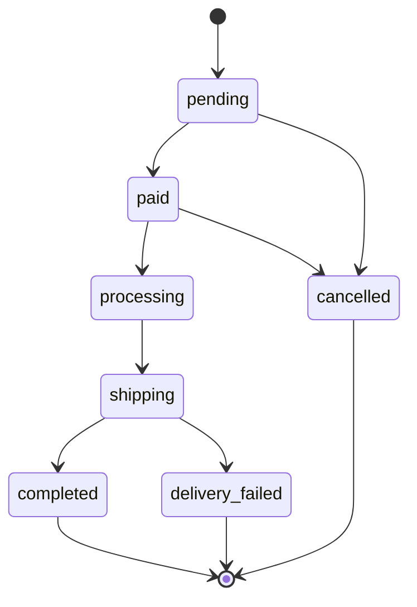

# 📚 Bookstore — Website Bán Sách Trực Tuyến

Website bán sách dành cho người đọc Việt Nam, gồm giao diện khách hàng (xem sách, giỏ hàng, đặt hàng, thanh toán chuyển khoản QR) và trang quản trị (quản lý sách, kho, đơn hàng, khách hàng). Thanh toán được xác nhận **tự động** qua webhook SePay, trạng thái đơn hàng cập nhật **realtime** qua Socket.io.


## Test case: https://docs.google.com/spreadsheets/d/13LO1f1RxPE0hw4KiqO7loRlkmdMGsK4e/edit?gid=113932193#gid=113932193)

## Mục lục

- [Tính năng](#tính-năng)
- [Tech stack](#tech-stack)
- [Cấu trúc thư mục](#cấu-trúc-thư-mục)
- [Cài đặt & chạy dự án](#cài-đặt--chạy-dự-án)
- [Biến môi trường](#biến-môi-trường)
- [Cơ sở dữ liệu](#cơ-sở-dữ-liệu)
- [API](#api)
- [Luồng đơn hàng & thanh toán](#luồng-đơn-hàng--thanh-toán)
- [Socket.io](#socketio)
- [Business rules quan trọng](#business-rules-quan-trọng)
- [Design system](#design-system)
- [Test case](#test-case)

---

## Tính năng

### Khách hàng
- Đăng ký, đăng nhập, xem/sửa hồ sơ, đổi mật khẩu
- Xem danh sách sách: tìm kiếm (FULLTEXT theo tên), lọc theo loại/tác giả/NXB, sắp xếp theo giá/mới nhất, phân trang
- Xem chi tiết sách với gallery nhiều ảnh
- Giỏ hàng: thêm, cập nhật số lượng, xóa
- Đặt hàng (checkout) với thanh toán chuyển khoản qua **QR VietQR** (đã nhúng sẵn số tiền + nội dung)
- Theo dõi trạng thái đơn hàng realtime, xem lại "Đơn hàng của tôi" (lọc theo trạng thái, ngày, mã đơn)
- Hủy đơn khi đơn còn ở trạng thái `pending`

### Quản trị (Admin)
- Dashboard tổng quan
- Quản lý sách (CRUD, soft-delete), upload nhiều ảnh lên Cloudinary, đặt ảnh đại diện
- Quản lý loại sách, tác giả, nhà xuất bản
- Quản lý nhà cung cấp và **phiếu nhập hàng** (tăng tồn kho)
- Quản lý đơn hàng: xem toàn bộ, cập nhật trạng thái theo đúng luồng cho phép
- Quản lý khách hàng: xem danh sách, khóa/mở khóa tài khoản
- Xem/sửa hồ sơ, đổi mật khẩu của chính mình

---

## Tech stack

| Thành phần | Công nghệ |
|---|---|
| Backend | Node.js + Express.js |
| Database | MySQL 8 |
| ORM / Query | `mysql2` (raw query) |
| Frontend | Vue 3 (Composition API) + Vue Router + Pinia |
| CSS | Tailwind CSS |
| Auth | JWT (`jsonwebtoken`) + `bcrypt` |
| Realtime | Socket.io |
| Thanh toán | SePay (webhook) + VietQR (tạo mã QR) |
| Lưu trữ ảnh | Cloudinary (upload qua `multer` memory storage) |
| API style | RESTful JSON |

---

## Cấu trúc thư mục

```
project-root/
├── backend/
│   ├── src/
│   │   ├── config/          # db.js, env.js, cloudinary.js
│   │   ├── models/          # user, category, author, publisher, book, bookImage,
│   │   │                    # cartItem, order, orderItem, payment,
│   │   │                    # supplier, stockImport, stockImportItem
│   │   ├── controllers/     # auth, user, book, bookImage, category, author, publisher,
│   │   │                    # cart, order, payment, supplier, stockImport
│   │   ├── routes/          # tương ứng với từng controller
│   │   ├── middlewares/     # auth, admin, error, upload
│   │   ├── sockets/         # orderSocket.js
│   │   ├── utils/           # generateOrderCode, generateImportCode, response
│   │   └── app.js
│   ├── .env.example
│   └── package.json
├── frontend/
│   ├── src/
│   │   ├── views/
│   │   │   ├── customer/    # Home, BookDetail, Cart, Checkout, OrderStatus,
│   │   │   │                # OrderList, Account, Login, Register
│   │   │   └── admin/       # Dashboard, BookManage, CategoryManage, AuthorManage,
│   │   │                    # PublisherManage, SupplierManage, StockImportManage,
│   │   │                    # OrderManage, CustomerManage, Account
│   │   ├── stores/          # Pinia: auth, cart, order
│   │   ├── services/        # axios: api, auth, user, book, cart, order
│   │   ├── router/
│   │   └── App.vue
│   └── package.json
└── docker-compose.yml
```

---

## Cài đặt & chạy dự án

### Yêu cầu

- Node.js (khuyến nghị bản LTS mới)
- MySQL 8
- Tài khoản [Cloudinary](https://cloudinary.com/) (lưu ảnh sách)
- Tài khoản [SePay](https://sepay.vn/) (xác nhận thanh toán tự động) — có thể bỏ qua khi chỉ chạy thử luồng COD/không thanh toán

### 1. Clone dự án

```bash
git clone <repo-url>
cd project-root
```

### 2. Tạo database

Chạy script SQL trong phần [Cơ sở dữ liệu](#cơ-sở-dữ-liệu) (mục 4 của file spec) để tạo database `bookstore` cùng toàn bộ các bảng.

### 3. Chạy backend

```bash
cd backend
npm install
cp .env.example .env     # sau đó điền giá trị thật, xem mục "Biến môi trường"
npm run dev
```

Backend mặc định chạy ở `http://localhost:3000`.

### 4. Chạy frontend

```bash
cd frontend
npm install
npm run dev
```

Frontend mặc định chạy ở `http://localhost:5173`.

### 5. Tạo tài khoản admin

API đăng ký chỉ tạo tài khoản `customer`. Để có tài khoản admin, hãy đăng ký 1 tài khoản bình thường rồi đổi `role` thành `admin` trực tiếp trong bảng `users`:

```sql
UPDATE users SET role = 'admin' WHERE email = 'admin@example.com';
```

### 6. Quy trình có dữ liệu để bán

Sách mới luôn có `stock_quantity = 0`. Để có hàng bán, admin cần tạo theo thứ tự:

1. Loại sách, tác giả, nhà xuất bản
2. Sách (sau đó upload ảnh)
3. Nhà cung cấp
4. **Phiếu nhập hàng** → tồn kho của sách được cộng lên

---

## Biến môi trường

Sao chép `backend/.env.example` thành `backend/.env` và điền giá trị:

```env
# Server
PORT=3000
NODE_ENV=development

# Database
DB_HOST=localhost
DB_PORT=3306
DB_NAME=bookstore
DB_USER=root
DB_PASSWORD=your_password

# JWT
JWT_SECRET=your_jwt_secret_key
JWT_EXPIRES_IN=7d

# SePay
SEPAY_API_TOKEN=your_sepay_api_token
SEPAY_WEBHOOK_SECRET=your_webhook_secret   # dùng để verify request từ SePay
SEPAY_ACCOUNT_NUMBER=your_bank_account
SEPAY_BANK_CODE=your_bank_code

# VietQR
VIETQR_BANK_BIN=970422                     # MB Bank = 970422, tra cứu tại https://vietqr.io/danh-sach-api
VIETQR_ACCOUNT_NUMBER=your_bank_account
VIETQR_ACCOUNT_NAME=NGUYEN VAN A           # KHÔNG dấu, viết hoa
VIETQR_TEMPLATE=compact2                   # compact | compact2 | qr_only | print

# Frontend URL (dùng cho CORS)
FRONTEND_URL=http://localhost:5173

# Cloudinary
CLOUDINARY_CLOUD_NAME=your_cloud_name
CLOUDINARY_API_KEY=your_api_key
CLOUDINARY_API_SECRET=your_api_secret
```

> ⚠️ **Không commit file `.env`** lên Git.

### Cấu hình webhook SePay

Trong SePay dashboard, trỏ webhook tới `POST https://<domain-của-bạn>/api/webhook/sepay` và cấu hình header `Authorization: Bearer <SEPAY_WEBHOOK_SECRET>`. Khi phát triển ở local, dùng công cụ tunnel (ngrok, cloudflared...) để SePay gọi được vào máy bạn.

---

## Cơ sở dữ liệu

Database `bookstore` (MySQL 8, `utf8mb4_unicode_ci`) gồm các nhóm bảng:

| Nhóm | Bảng |
|---|---|
| Người dùng | `users` |
| Danh mục sản phẩm | `categories`, `authors`, `publishers`, `books`, `book_images` |
| Mua hàng | `cart_items`, `orders`, `order_items`, `payments`, `order_status_history` |
| Nhập kho | `suppliers`, `stock_imports`, `stock_import_items` |

Một số điểm cần lưu ý:

- `books` liên kết tới `categories`, `authors`, `publishers` qua khóa ngoại.
- Một sách có **nhiều ảnh** (`book_images`); DB chỉ lưu URL và `cloudinary_public_id`, ảnh thật nằm trên Cloudinary.
- `order_items` **snapshot** `book_title` và `price` tại thời điểm đặt hàng.
- `books.stock_quantity` chỉ được thay đổi theo các nguồn đã quy định (xem [Business rules](#business-rules-quan-trọng)).

Toàn bộ script `CREATE TABLE` nằm ở **mục 4** của file spec `spec-bookstore-project.md`.

---

## API

Base URL: `http://localhost:3000/api`. Xác thực bằng header `Authorization: Bearer <token>`.

### Chuẩn response

```json
{ "success": true, "message": "Lấy danh sách sách thành công", "data": { } }
```

```json
{ "success": false, "message": "Email đã tồn tại", "error_code": "EMAIL_EXISTS" }
```

Mã HTTP sử dụng: `200`, `201`, `400`, `401`, `403`, `404`, `409`, `500`.

### Phân trang & tìm kiếm

Mọi endpoint `GET` trả về danh sách đều nhận `page` (mặc định 1) và `limit` (mặc định 10, riêng `books` là 12), kèm `?keyword=` nếu module có tìm kiếm. Response luôn có:

```json
"pagination": { "page": 1, "limit": 10, "total": 45, "total_pages": 5 }
```

### Danh sách endpoint

| Module | Endpoint | Quyền |
|---|---|---|
| **Auth** | `POST /auth/register`, `POST /auth/login` | Public |
| | `GET /auth/me`, `PUT /auth/me`, `PUT /auth/change-password` | Đăng nhập |
| **Categories** | `GET /categories`, `GET /categories/:id` | Public |
| | `POST`, `PUT /:id`, `DELETE /:id` | Admin |
| **Authors** | `GET /authors`, `GET /authors/:id` | Public |
| | `POST`, `PUT /:id`, `DELETE /:id` | Admin |
| **Publishers** | `GET /publishers`, `GET /publishers/:id` | Public |
| | `POST`, `PUT /:id`, `DELETE /:id` | Admin |
| **Books** | `GET /books`, `GET /books/:id` | Public |
| | `POST /books`, `PUT /books/:id`, `DELETE /books/:id` | Admin |
| | `POST /books/:id/images` (multipart, tối đa 5 ảnh × 5MB, jpg/jpeg/png/webp) | Admin |
| | `DELETE /books/:id/images/:imageId` | Admin |
| | `PUT /books/:id/images/:imageId/primary` | Admin |
| **Cart** | `GET /cart`, `POST /cart`, `PUT /cart/:bookId`, `DELETE /cart/:bookId`, `DELETE /cart` | Customer |
| **Orders** | `POST /orders`, `GET /orders`, `GET /orders/:id`, `GET /orders/:id/status` | Đăng nhập |
| | `PUT /orders/:id/status` | Admin |
| | `DELETE /orders/:id` (chỉ khi `pending`) | Đăng nhập |
| **Webhook** | `POST /webhook/sepay` | Public (verify secret) |
| **Suppliers** | `GET`, `GET /:id`, `POST`, `PUT /:id`, `DELETE /:id` tại `/suppliers` | Admin |
| **Stock imports** | `GET /stock-imports`, `GET /stock-imports/:id`, `POST /stock-imports` | Admin |
| **Users** | `GET /users`, `GET /users/:id` | Admin |
| | `PUT /users/:id/lock`, `PUT /users/:id/unlock` | Admin |

Request/response mẫu chi tiết của từng endpoint nằm ở **mục 6** của file spec.

#### Ví dụ: đăng nhập

```http
POST /api/auth/login
Content-Type: application/json

{ "email": "a@example.com", "password": "123456" }
```

```json
{
  "success": true,
  "message": "Đăng nhập thành công",
  "data": {
    "token": "eyJhbGciOi...",
    "user": { "id": 5, "full_name": "Nguyễn Văn A", "role": "customer" }
  }
}
```

---

## Luồng đơn hàng & thanh toán

### Trạng thái đơn hàng

Trạng thái chỉ đi **một chiều** theo đúng bảng chuyển đổi dưới đây; `completed`, `cancelled`, `delivery_failed` là trạng thái kết thúc.



| Trạng thái | Nhãn hiển thị |
|---|---|
| `pending` | Chờ xử lý |
| `paid` | Đã thanh toán |
| `processing` | Đang chuẩn bị |
| `shipping` | Đang giao |
| `completed` | Hoàn thành |
| `cancelled` | Đã hủy |
| `delivery_failed` | Giao không thành công |

### Luồng thanh toán chuyển khoản

1. Khách checkout → backend tạo đơn `pending`, sinh mã đơn dạng `DH20260814001` và trả về `qr_url` (VietQR).
2. Khách quét QR và chuyển khoản (số tiền + nội dung = mã đơn đã được điền sẵn).
3. SePay gọi `POST /api/webhook/sepay` khi có tiền vào tài khoản.
4. Backend verify secret → tìm mã đơn trong nội dung chuyển khoản → **so khớp số tiền** → nếu khớp thì chuyển đơn sang `paid`, trừ tồn kho, ghi lịch sử.
5. Server emit socket `order:paid` tới đúng khách hàng → giao diện tự cập nhật.

> QR VietQR chỉ hỗ trợ trải nghiệm (khỏi gõ tay), **không phải cơ chế bảo mật**. Một số app ngân hàng vẫn cho sửa số tiền/nội dung, nên bước so khớp ở webhook là bắt buộc. Nếu lệch số tiền, giao dịch được đánh dấu `failed` để admin xử lý thủ công.

### Giao hàng thất bại

Khi admin chuyển `shipping → delivery_failed` (khách không nhận hàng), hệ thống chạy trong 1 transaction: cập nhật trạng thái, **hoàn lại tồn kho** cho từng sách, ghi lịch sử (bắt buộc kèm lý do) và emit socket.

---

## Socket.io

| Event | Hướng | Payload | Khi nào |
|---|---|---|---|
| `order:paid` | Server → Client | `{ order_id, order_code, status: "paid" }` | Webhook xác nhận thanh toán thành công |
| `order:status_updated` | Server → Client | `{ order_id, status }` | Admin đổi trạng thái đơn |

Sau khi đăng nhập, client gửi `socket.emit('join', userId)`; server đưa socket vào room `user_<userId>` và emit riêng cho từng khách.

---

## Business rules quan trọng

1. Mật khẩu luôn hash bằng bcrypt và **không bao giờ** trả về trong response.
2. `order_items.price` và `book_title` là snapshot lúc đặt hàng, không join lại `books` để lấy giá hiện tại.
3. `books.stock_quantity` **chỉ** thay đổi qua 3 nguồn:
   - (+) Tạo phiếu nhập hàng thành công
   - (+) Đơn chuyển sang `delivery_failed` (hoàn kho)
   - (−) Đơn chuyển sang `paid`

   API tạo/sửa sách **không được đọc** `stock_quantity` từ request body; sách mới luôn có tồn kho bằng 0.
4. Tạo đơn, xử lý webhook, tạo phiếu nhập, chuyển đơn sang `delivery_failed` đều phải dùng **database transaction**.
5. Webhook không yêu cầu JWT nhưng bắt buộc verify bằng secret riêng.
6. Trạng thái đơn hàng chỉ chuyển theo đúng bảng cho phép, không set tùy ý.
7. Không xóa `category` / `author` / `publisher` nếu còn sách tham chiếu; không xóa `supplier` nếu còn phiếu nhập tham chiếu → trả `409`.
8. Đăng xuất xử lý hoàn toàn ở client (xóa token khỏi `localStorage` + reset Pinia store), không có API logout.
9. Ảnh sách luôn lưu trên Cloudinary; khi xóa ảnh phải gọi `cloudinary.uploader.destroy()` **trước**, rồi mới xóa row trong `book_images`.
10. Tài khoản bị khóa (`is_active = 0`) không đăng nhập được (`403 ACCOUNT_LOCKED`). Không cho khóa tài khoản `admin`.
11. Mọi endpoint `GET` danh sách đều phải phân trang theo quy ước chung, không có ngoại lệ.

---


## Tài liệu liên quan

- `spec-bookstore-project.md` — đặc tả kỹ thuật đầy đủ: database, API, luồng nghiệp vụ, business rules, design system.
